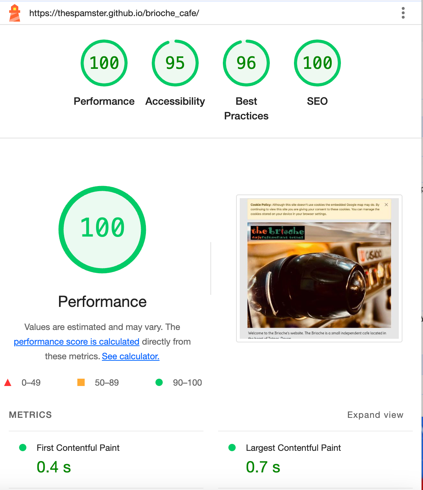

# Brioche Cafe

Site under construction for The Brioche Cafe in Totnes, Devon, UK

I currently help to pay my bills by working at the Brioche, it's a fab independent cafe and well worth a visit if you're in the area. 

The owner mentioned they have an old website and I offered to design and code a new one.

Having redesigned my wife's business website I took the basic layout of that site and then adapted it to create this one.
The owner of the Brioche gave me some guidelines as to what was wanted.

- Contact has to be via email and social media, no phone numbers.
- The owner didn't want to appear on the site. He stressed that the site needed to be about the cafe.

## Technologies Used

- Bootstrap v5 CSS & Javascript library [Bootstrap v5.3](https://getbootstrap.com/)
- To create the favicon for the title bar, [favicon.io](https://favicon.io/favicon-generator/)
- Custom Google fonts [Google Fonts](https://fonts.google.com/)

## Media

- All images used were shot on my iPhone 14.
- Credit to [Freepik at Flaticons.com](https://www.flaticon.com) for the Facebook, Instagram, Email and Twitter icons. Check them out. Awesome icons for free!

## Performance and Testing

- Google Lighthouse tests for Performance, Accessibility, Best Practices and SEO.

- Resource hint validator [DebugBear](https://www.debugbear.com/resource-hint-validator)

Note: the site layout is complete. The text needs to be checked by the myself and the owner and any final adjustments made.
